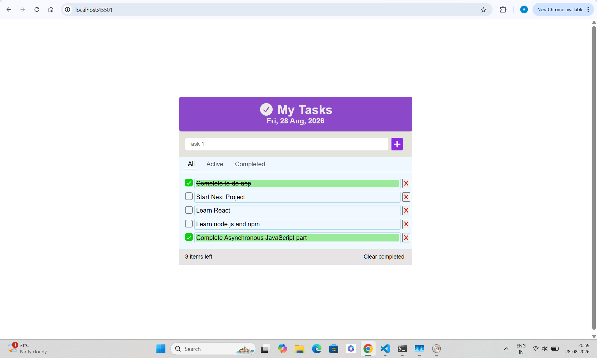
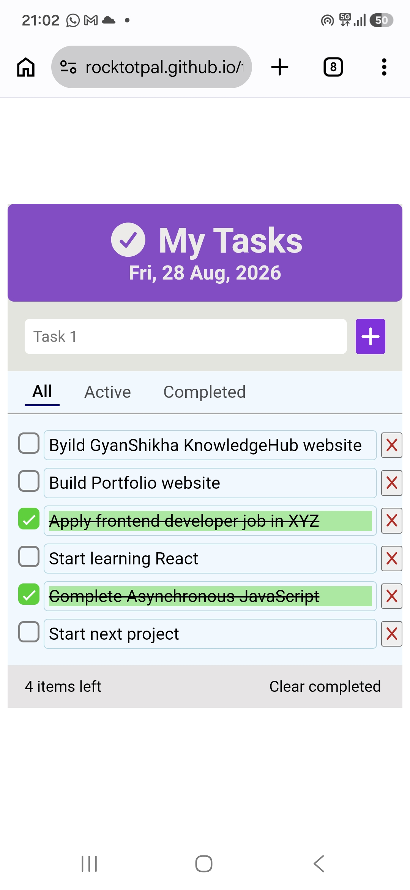

# to-do-list

A clean, responsive to-do list app built with vanilla HTML, CSS, and JavaScript. Add tasks, mark them complete, filter by status, and clear completed items — all with a lightweight, dependency-free front end.

## Live Demo:

[Live Demo](https://rocktotpal.github.io/to-do-list/)

## Overview

To-do-list is a task management web app that lets users add, complete, filter, and delete to-do items through a simple, distraction-free interface. It was built as a hands-on project to practice core JavaScript concepts — DOM manipulation, event delegation, array/object handling, and state-driven UI rendering — without relying on any frameworks or libraries.

## Features

- Add new tasks via input field or Enter key
- Mark tasks as complete/incomplete with a custom-styled checkbox
- Filter tasks by All, Active, or Completed
- Live count of remaining active tasks
- Clear all completed tasks in one click
- Empty-state message when no tasks match the current filter
- Input validation modal when trying to add an empty task
- Fully responsive layout for mobile and desktop
- Persist tasks with localStorage so the list survives a page refresh

## Technology Used

- HTML5 — semantic structure
- CSS3 — Flexbox layout, custom checkbox styling, responsive media queries
- JavaScript (Vanilla) — DOM manipulation, event delegation, array methods (filter, findIndex, forEach)
- Font Awesome — icons

## Getting Started

No build tools or dependencies required.

Clone or download this repository
Open index.html in your browser

That's it — the app runs entirely client-side.

## What I Learned

- Event delegation: attaching a single listener to the parent list (.todos-list) instead of one per task, using e.target.closest() to identify which item was clicked.
- CSS cascade vs. specificity: debugged a real bug where a .hidden utility class and a .modal component class had equal specificity, so the cascade fell back to source order to resolve the conflict. Learned that specificity is a fixed score based on selector composition — not something that changes with rule order — and that the safer fix is increasing specificity intentionally (e.g. .modal.hidden) rather than depending on file order.
- State-driven rendering: keeping a single source of truth (taskArr) and re-rendering the DOM from that array on every change, rather than manually patching individual DOM nodes.
- Debugging with DevTools: used "Inspect Element" to identify that clicks were being intercepted by an invisible, mis-stacked element rather than a JavaScript logic bug.

## Challenges Faced

The trickiest bug in this project wasn't in the JavaScript at all — it was CSS. The filter buttons ("All" / "Active" / "Completed") became unclickable in certain areas and inconsistently on mobile. Inspecting the "dead" area revealed the culprit: a modal window with display: none and opacity: 0 intended to be hidden, but a competing .modal rule with equal specificity was overriding display: none due to source order, leaving the modal fully laid out and absolutely positioned — invisible, but still intercepting clicks. Fixed by increasing the specificity of the hiding rule (.modal.hidden) so it reliably wins regardless of stylesheet order.

## Future Improvements

- Add the ability to edit an existing task's text
- Add drag-and-drop task reordering
- Add subtle animations for adding/removing/completing tasks

## Screentshot

# Desktop View

# Mobile view

## Folder Structure

to-do-list/
├── images/
├── index.html
├── style.css
├── script.js
├── PLAN.md
└── README.md
